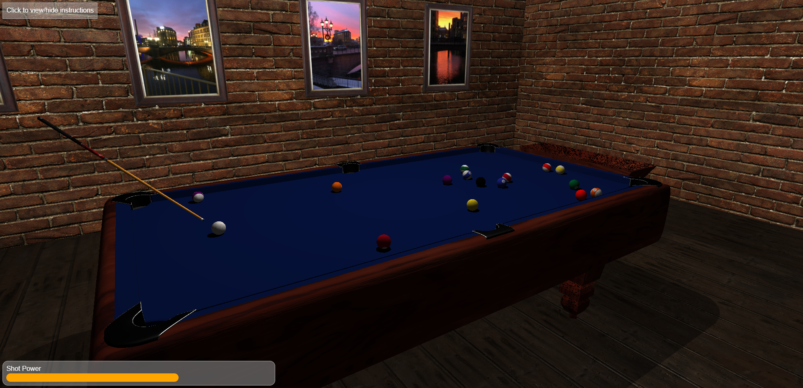

# TNM085 - Billiard simulator

A physics simulation applied for a game of billiard using Three.js and WebGL. The balls' positions are determined using first order Euler method given their forces from friction and impact from other balls. The physics simulation also accommodate for accurate collision between spheres, and different frictions between balls and the pool table if the balls are sliding or rolling. The physics were first developed using MATLAB, code [available here](https://github.com/casperlarsson-bit/TNM085-Billiard-Simulation-MATLAB), and then visuals were added through a web application.



## Folder structure

```
.
├── assets      # glTF files, blender files merged with textures
├── css         # Styling for UI
├── images      # Example image of game play
├── js          # JavaScript, main files
├── textures    # Textures for balls and posters
└── README.md
```

## Setup instructions

The simulation is created with [Three.js](https://threejs.org/) which requires a webserver to run. Setup is for live server in VSCode. Any other server method will work. Do _not_ open the files directly in the folders, since they will not load properly then

- Install [Live Server](https://marketplace.visualstudio.com/items?itemName=ritwickdey.LiveServer) extension in VSCode.
- Open the main folder in VSCode (Ctrl+Shift+E)
- Press the _Go Live_ text at the bottom menu bar
- The website should open automatically, otherwise it is usually hosted at [http://127.0.0.1:5501/](http://127.0.0.1:5501/)

## Known issues

There are a few visual issues, and possible issues with the physics logic:

- The blender imports will not recieve shadows correctly. This is currently solved by placing an invisible plane on top of the pool table, which recieves the shadows from the balls. It works but not ideal.
- When balls recieve too high of a velocity after a collision, they sometimes stay in place, just spinning without updating its position.
- Additionally, when the balls are traveling too fast they do not sample quickly enough to trigger collisions between two balls and might travel through it.

## Further development

Currently the code base is implemented using traditional data structures, such as arrays and objects. A cleaner version would convert the balls into its own class, with an array of instances instead of multiple arrays for the balls' positions, velocities, etc.

The controls could also be updated. Right now the user would use the arrow keys to rotate the billiard cue, with a fixed sample. This results in not every angle being represented. A possible solution is to just shoot in the direction the camera is angled.
